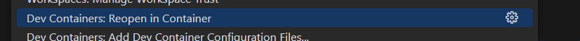

# Frappe Docker Devcontainer Template

This is a template for creating a Frappe Docker development environment using Visual Studio Code's Dev Containers feature. It provides a pre-configured setup for developing Frappe applications in a containerized environment.

## Features

- Pre-configured Dockerfile and devcontainer.json for Frappe development
- Support for multiple Frappe versions
- Customizable environment variables
- Pre-installed dependencies for Frappe development
- Support for running Frappe applications in a containerized environment
- Integration with Visual Studio Code for a seamless development experience
- Automated setup and configuration of the development environment
- Automated install necessary vscode extensions

## Prerequisites

- Docker: Make sure you have Docker installed on your machine. You can download it from [Docker's official website](https://www.docker.com/get-started).
- Visual Studio Code: Install Visual Studio Code from [the official website](https://code.visualstudio.com/).
- Dev Containers extension: Install the Dev Containers extension for Visual Studio Code. You can find it in the Extensions Marketplace by searching for "Dev Containers" or by visiting [this link](https://marketplace.visualstudio.com/items?itemName=ms-vscode-remote.remote-containers).
- Git: Ensure you have Git installed on your machine. You can download it from [Git's official website](https://git-scm.com/).
- Node.js: Install Node.js from [the official website](https://nodejs.org/). This is required for running Frappe applications.
- Python: Make sure you have Python installed on your machine. You can download it from [Python's official website](https://www.python.org/downloads/).
- Yarn: Install Yarn package manager from [the official website](https://yarnpkg.com/getting-started/install). This is required for managing JavaScript dependencies in Frappe applications.
- Redis: Install Redis from [the official website](https://redis.io/download). This is required for caching and session management in Frappe applications.
- MariaDB: Install MariaDB from [the official website](https://mariadb.org/download/). This is required for the database backend in Frappe applications.
- Nginx: Install Nginx from [the official website](https://nginx.org/en/download.html). This is required for serving Frappe applications in production.
- PostgreSQL: Install PostgreSQL from [the official website](https://www.postgresql.org/download/). This is required for the database backend in Frappe applications.
- wkhtmltopdf: Install wkhtmltopdf from [the official website](https://wkhtmltopdf.org/downloads.html). This is required for generating PDF reports in Frappe applications.

## Usage

1. Clone this repository to your local machine:

   ```bash
   git clone https://github.com/SadNguyen2107/Frappe-Docker-Template.git
   ```

   Or you can use SSH if you have set up SSH keys:

    ```bash
    git clone git@github.com:SadNguyen2107/Frappe-Docker-Template.git
    ```

2. Open the cloned repository in Visual Studio Code.
3. Remove the `.git` folder if you want to start a new project:

   ```bash
   rm -rf .git
   ```

    Or you can use the following command if you are using Windows:

    ```bash
    rmdir /s /q .git
    ```

    Or you can use the following command if you are using macOS:

    ```bash
    rm -rf .git
    ```

4. Open the Command Palette (`Ctrl + Shift + P` or `Cmd + Shift + P` on macOS) and select `Dev Containers: Reopen in Container`.

    

5. Wait for the container to build and start. This may take a few minutes, depending on your internet connection and system performance.
6. Once the container is running, you can start developing your Frappe application. The container will have all the necessary dependencies and tools pre-installed.
7. Initialize the Frappe application by running the following command in the integrated terminal:

   ```bash
   bench init --skip-redis-config-generation --frappe-branch version-15 frappe-bench ${FRAPPE_PROJECT_NAME}
   ```

   Replace `${FRAPPE_PROJECT_NAME}` with the desired name of your Frappe project (e.g., `frappe-bench`).

   Example:

    ```bash
    bench init --skip-redis-config-generation --frappe-branch version-15 frappe-bench
    ```

8. Change the directory to the newly created Frappe project:

    ```bash
    cd ${FRAPPE_PROJECT_NAME}
    ```

    Example:

    ```bash
    cd frappe-bench
    ```

9. Create app
    For Frappe, run the following command:

    ```bash
    bench new-app ${APP_NAME}
    ```

    Replace `${APP_NAME}` with your desired app name.

10. Create a new site by running the following command:

    ```bash
    bench new-site mysite.local
    ```

    Replace `mysite.local` with your desired site name.

11. Install app on site

    ```bash
    bench --site mysite.local install-app ${APP_NAME}
    ```

    Replace `mysite.local` with your site name.
    Replace `${APP_NAME}` with the name of the app you created in step 9.

12. To start the Frappe development server, run the following command:

    ```bash
    bench start
    ```

13. You can access the Frappe application in your web browser at `http://mysite.local:8000`. The default username and password are `Administrator` and `admin`, respectively.

14. To stop the container, you can use the `Dev Containers: Stop Container` command from the Command Palette or simply close Visual Studio Code. The container will be stopped automatically.

15. To remove the container, you can use the `Dev Containers: Remove Container` command from the Command Palette. This will remove the container and all its data. If you want to keep the data, you can use the `Dev Containers: Rebuild Container` command instead.

16. To rebuild the container with a different Frappe version, you can modify the `FRAPPE_VERSION` variable in the `.devcontainer/devcontainer.json` file and then use the `Dev Containers: Rebuild Container` command from the Command Palette.

17. To customize the environment variables, you can modify the `ENV` section in the `.devcontainer/Dockerfile` file. You can add or remove environment variables as needed. Make sure to rebuild the container after making any changes to the Dockerfile.

18. To install additional dependencies, you can modify the `RUN` section in the `.devcontainer/Dockerfile` file. You can add or remove dependencies as needed. Make sure to rebuild the container after making any changes to the Dockerfile.

19. To run the Frappe application in production mode, you can modify the `CMD` section in the `.devcontainer/Dockerfile` file. You can change the command to start the Frappe application in production mode. Make sure to rebuild the container after making any changes to the Dockerfile.

20. To run the Frappe application in development mode, you can modify the `CMD` section in the `.devcontainer/Dockerfile` file. You can change the command to start the Frappe application in development mode. Make sure to rebuild the container after making any changes to the Dockerfile.

21. To run the Frappe application in test mode, you can modify the `CMD` section in the `.devcontainer/Dockerfile` file. You can change the command to start the Frappe application in test mode. Make sure to rebuild the container after making any changes to the Dockerfile.

22. To run the Frappe application in production mode with SSL, you can modify the `CMD` section in the `.devcontainer/Dockerfile` file. You can change the command to start the Frappe application in production mode with SSL. Make sure to rebuild the container after making any changes to the Dockerfile.

23. Remove all irrelevant files and folders that are not needed for your project.

- `.git` folder
- `.gitignore` file
- `README.md` file
- `image.png` file
- `LICENSE` file
